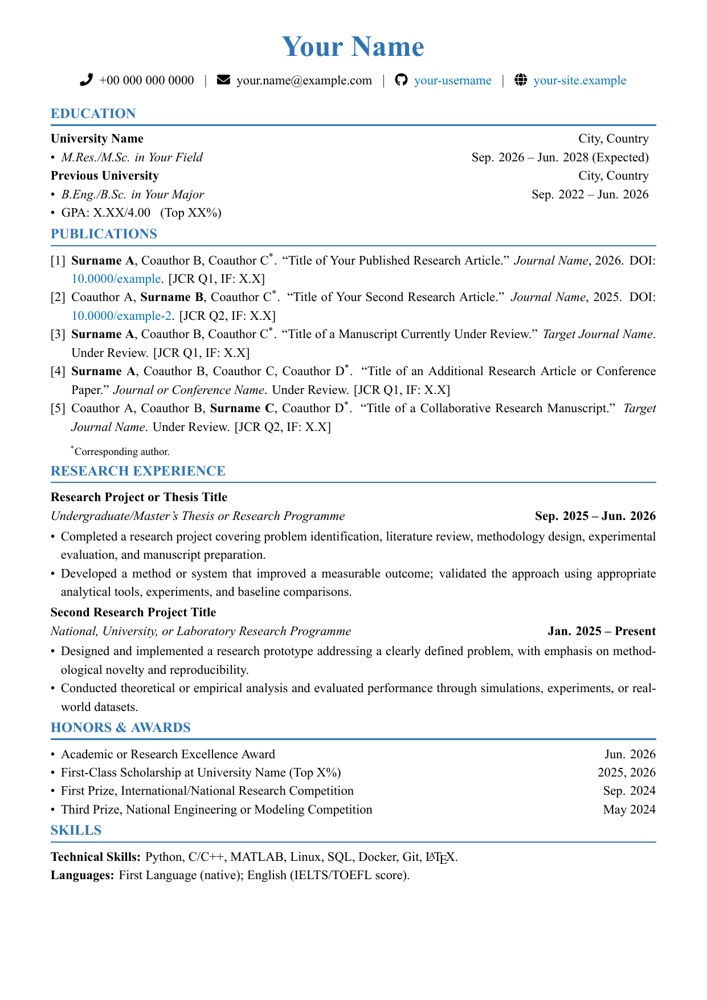

# English Academic CV LaTeX Template

A clean, compact, one-page academic CV template designed for:

- PhD and MRes applications
- contacting prospective supervisors and research groups
- research internship and scholarship applications
- early-career researchers who want to highlight publications and research experience

The template uses XeLaTeX, an A4 layout, a publication-focused structure, and a restrained blue academic style.



## Repository contents

- `academic-cv-template.tex` — editable XeLaTeX source
- `academic-cv-template.pdf` — compiled example CV
- `preview.png` — README preview image
- `LICENSE` — MIT License

All content in the example CV is fictional placeholder text. Replace it with your own verified information before use.

## Features

- single-page academic layout
- sections for education, publications, research experience, honors, and skills
- right-aligned dates and locations
- clickable GitHub, website, and DOI links
- no profile photo or external image assets
- Times New Roman when installed, with TeX Gyre Termes as an open fallback
- suitable for Overleaf and local TeX installations

## Quick start

### Overleaf

1. Download or clone this repository.
2. Upload the files to a new Overleaf project.
3. Set the compiler to **XeLaTeX**.
4. Edit `academic-cv-template.tex` and recompile.

### Local compilation

Install a recent TeX Live or MiKTeX distribution, then run:

```bash
xelatex academic-cv-template.tex
xelatex academic-cv-template.tex
```

The second pass ensures that links and PDF metadata are fully refreshed.

## Customization checklist

Search the source file for the following placeholders:

- `Your Name`
- `your.name@example.com`
- `your-username`
- `your-site.example`
- `University Name`
- `Surname A`
- `X.XX`, `XX%`, and `X.X`

For publications, keep the official author order and article title. Replace the example DOI URLs as well as their visible text.

If the CV becomes longer than one page, prioritize the information most relevant to the target supervisor or programme. You can also duplicate or remove publication and research entries as needed.

## Privacy reminder

Before publishing your edited CV, search the source and PDF for phone numbers, personal email addresses, student IDs, home addresses, and any confidential manuscript details you do not intend to disclose.

## License

This project is released under the MIT License. See [LICENSE](LICENSE) for details.
